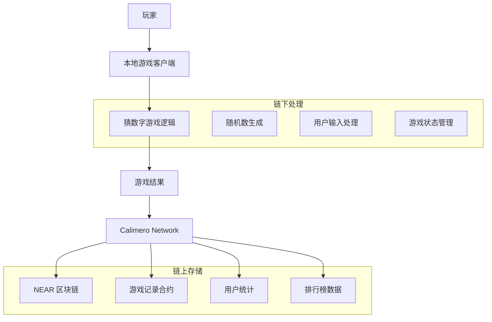

# 猜数字游戏 - Calimero x NEAR 集成演示

这个演示项目展示了如何将经典的 Rust 猜数字游戏与 Calimero Network 集成，实现链下游戏逻辑和链上结果存储的混合架构。游戏过程在本地执行，而游戏结果通过 Calimero 存储到 NEAR 区块链上。

## 🎯 项目概述

### 核心特性
- **链下游戏逻辑**: 猜数字游戏完全在本地运行，确保快速响应和流畅体验
- **链上结果存储**: 游戏结果通过 Calimero Network 安全存储到 NEAR 区块链
- **数据所有权**: 利用 Calimero 的数据所有权特性，用户完全控制自己的游戏数据
- **隐私保护**: 游戏过程保持私密，仅结果上链
- **去中心化身份**: 集成 DID (去中心化身份) 进行用户身份管理

### 架构优势
- **混合计算模型**: 链下计算 + 链上存储，兼顾性能与可信度
- **成本效益**: 仅关键数据上链，大幅降低 Gas 费用
- **用户体验**: 游戏过程无延迟，链上操作异步处理
- **可扩展性**: 框架可扩展到更复杂的游戏逻辑

## 🎮 游戏说明

这是基于《Rust 程序设计语言》第二章的经典猜数字游戏的增强版本：

1. **游戏规则**: 系统随机生成一个 1-100 之间的数字，玩家进行猜测
2. **游戏反馈**: 系统提示"太大了"、"太小了"或"猜对了"
3. **游戏记录**: 每局游戏的结果（尝试次数、用时、最终结果）都会存储到区块链
4. **历史查询**: 玩家可以查询自己的历史游戏记录

## 🏗️ 技术架构



### 核心组件

#### 1. 游戏引擎 (Off-chain)
- **随机数生成器**: 使用 `rand` crate 生成安全随机数
- **游戏逻辑处理**: 本地处理用户输入和游戏状态
- **性能优化**: 无网络延迟的即时反馈

#### 2. Calimero 集成层
- **数据桥接**: 连接本地游戏和区块链存储
- **身份管理**: DID 集成，确保用户身份一致性
- **数据加密**: 游戏数据加密存储和传输

#### 3. NEAR 智能合约
- **游戏记录存储**: 存储游戏结果和统计数据
- **用户排行榜**: 维护全局和个人游戏统计
- **数据查询接口**: 提供历史记录查询功能

## 🚀 快速开始

### 前置要求
- Rust 1.70+
- NEAR CLI 工具
- Calimero Network 节点访问权限

### 1. 环境设置

```bash
# 克隆项目
git clone https://github.com/calimero-network/core.git
cd core/demos/guess-number-module

# 安装依赖
cargo build

# 配置 NEAR 账户 (如果没有的话)
near login
```

### 2. 部署智能合约

```bash
# 构建合约
cargo build --target wasm32-unknown-unknown --release

# 部署到 NEAR 测试网
near deploy --wasmFile target/wasm32-unknown-unknown/release/guess_number_contract.wasm --accountId your-account.testnet
```

### 3. 配置 Calimero 节点

```bash
# 启动本地 Calimero 节点
merod --config config/local-node.toml

# 创建游戏上下文
meroctl context create --name guess-number-game
```

### 4. 运行游戏

```bash
# 启动游戏客户端
cargo run --bin guess-number-client

# 或者使用 Web 界面
cargo run --bin guess-number-server
# 访问 http://localhost:8080
```

## 🎯 使用示例

### 命令行版本

```bash
$ cargo run --bin guess-number-client

🎮 欢迎来到链上猜数字游戏！
📊 连接到 Calimero Network...
✅ 已连接到 NEAR 测试网

🎲 开始新游戏 (输入 'quit' 退出)
💭 猜一个 1 到 100 之间的数字: 50
📈 太大了！尝试一个更小的数字
💭 猜一个 1 到 100 之间的数字: 25
📉 太小了！尝试一个更大的数字
💭 猜一个 1 到 100 之间的数字: 37
🎉 恭喜！你猜对了！

📋 游戏统计:
   🎯 目标数字: 37
   🔄 尝试次数: 3
   ⏱️  游戏时长: 45 秒
   💾 正在保存到区块链...
   ✅ 游戏记录已保存！

🏆 你的游戏历史:
   📊 总游戏数: 15
   🎯 平均尝试次数: 4.2
   ⭐ 最佳记录: 2 次猜中
```

### Web 界面版本

访问 `http://localhost:8080` 体验完整的 Web 游戏界面，包括：
- 实时游戏互动
- 可视化统计图表
- 历史记录查看
- 全球排行榜

## 📊 API 接口

### 游戏接口

```bash
# 开始新游戏
POST /api/game/start
{
  "player_id": "user123",
  "difficulty": "normal"
}

# 提交猜测
POST /api/game/guess
{
  "game_id": "game_uuid",
  "guess": 42
}

# 获取游戏状态
GET /api/game/{game_id}/status

# 结束游戏并保存到链上
POST /api/game/{game_id}/finish
```

### 统计接口

```bash
# 获取玩家统计
GET /api/stats/player/{player_id}

# 获取全球排行榜
GET /api/stats/leaderboard

# 获取游戏历史
GET /api/history/{player_id}
```

## 🔧 配置说明

### Calimero 配置 (config/calimero.toml)

```toml
[network]
node_id = "guess-number-node"
context_id = "guess-number-context"

[near]
network = "testnet"
contract_account = "guess-number.testnet"

[storage]
provider = "near"
encryption = true

[game]
min_number = 1
max_number = 100
max_attempts = 10
timeout_seconds = 300
```

### NEAR 合约配置

```rust
// 游戏记录结构
#[derive(Serialize, Deserialize)]
pub struct GameRecord {
    pub player_id: String,
    pub target_number: u32,
    pub attempts: u32,
    pub duration_seconds: u64,
    pub timestamp: u64,
    pub success: bool,
}

// 玩家统计
#[derive(Serialize, Deserialize)]
pub struct PlayerStats {
    pub total_games: u32,
    pub total_wins: u32,
    pub average_attempts: f64,
    pub best_score: u32,
    pub total_time: u64,
}
```

## 🔐 数据隐私与安全

### 隐私保护机制
1. **游戏过程隐私**: 游戏过程完全在本地进行，不会泄露中间步骤
2. **选择性上链**: 只有最终结果和统计数据上链存储
3. **数据加密**: 敏感数据通过 Calimero 加密处理
4. **身份保护**: 支持匿名游戏模式

### 安全特性
- **防作弊机制**: 通过密码学证明确保游戏结果真实性
- **数据完整性**: 区块链保证历史记录不可篡改
- **访问控制**: 基于 DID 的细粒度权限管理

## 📈 性能优化

### 链下优化
- **零延迟游戏**: 所有游戏交互都在本地完成
- **批量上链**: 累积多个游戏结果后批量提交
- **缓存机制**: 本地缓存历史数据，减少链上查询

### 链上优化
- **数据压缩**: 优化合约存储结构
- **Gas 优化**: 最小化链上计算复杂度
- **批处理**: 支持批量操作降低成本
